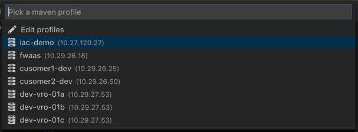
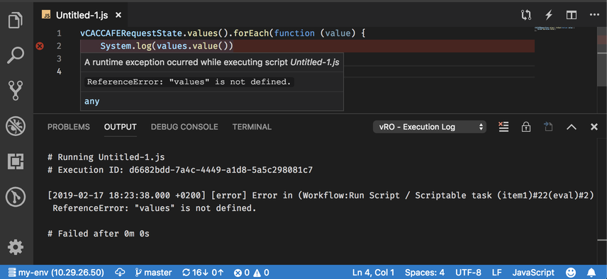
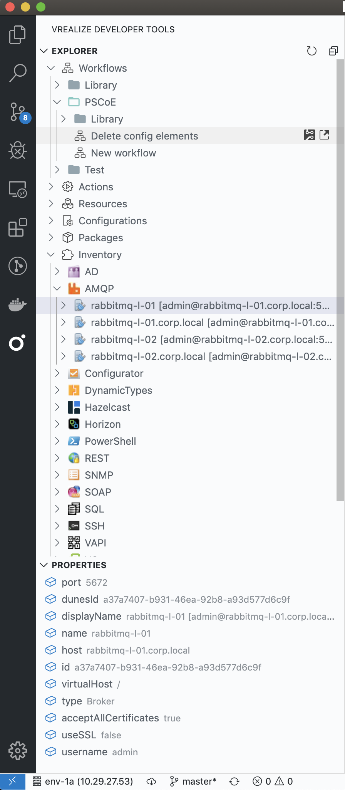

# vRealize Developer Tools

> A [Visual Studio Code](https://code.visualstudio.com/) extension that provides code intelligence features and enables a more
> developer-friendly experience when creating [vRealize Orchestrator](https://www.vmware.com/products/vrealize-orchestrator.html)
> and [vRealize Automation](https://www.vmware.com/products/vrealize-automation.html) content.

[](https://marketplace.visualstudio.com/items?itemName=vmware-pscoe.vrealize-developer-tools)
[](https://github.com/vmware/vrealize-developer-tools/actions)
[](https://david-dm.org/vmware/vrealize-developer-tools)
[](https://codecov.io/gh/vmware/vrealize-developer-tools/)

## Prerequisites

To use most of the vRealize Developer Tools's functionality, you will need a development [vRealize Orchestrator](https://www.vmware.com/products/vrealize-orchestrator.html) instance and to set up vRealize Build Tools.

-   [vRealize Build Tools v1.7.1+](https://labs.vmware.com/flings/vrealize-build-tools)
-   maven v3.5+ available on the PATH system variable
-   jdk 1.8

## Features

### Multiple environments

Connect to different vRO environments by configuring maven profiles in `~/.m2/settings.xml`.

```xml
<profile>
    <id>my-env</id>
    <properties>
        <!-- vRO Connection -->
        <vro.host>10.27.120.27</vro.host>
        <vro.port>443</vro.port>
        <vro.username>administrator@vsphere.local</vro.username>
        <vro.password>myPlainTextPass</vro.password>
        <vro.auth>basic</vro.auth> <!-- or 'vra' for sso auth -->
        <vro.tenant>vsphere.local</vro.tenant> <!-- required for 'vra' auth -->

        <!-- vRA Connection -->
        <vra.host>10.27.120.27</vra.host>
        <vra.port>443</vra.port>
        <vra.username>configurationadmin@vsphere.local</vra.username>
        <vra.password>myPlainTextPass</vra.password>
        <vra.tenant>vsphere.local</vra.tenant>
    </properties>
</profile>
```

Once vRealize Developer Tools extension is activated in VS Code, on the bottom left corner of the status bar, an idicator is shown if there is no currently active profile.


Click on it to see list of all available profiles and select one to activate.



Active profile name and the IP address of the vRealize Orchestrator instance is shown in the status bar.


### Project on-boarding

The `vRealize: New Project` command from the VS Code comand palette (<kbd>Cmd+Shift+P</kbd> / <kbd>Ctrl+Shift+P</kbd>) can be used to on-board a new vRealize project.


### vRO-aware IntelliSense

Visual Studio Code's IntelliSense feature for JavaScript files is enhanced with with symbols and information from the vRO’s core scripting API, plug-in objects and actions.


### Run action

The `vRealize: Run Action` command from the VS Code comand palette (<kbd>Cmd+Shift+P</kbd> / <kbd>Ctrl+Shift+P</kbd>) allows running an action JavaScript file in live vRO instance while seeing the logs in the OUTPUT panel.



### Explore the inventory

A vRO explorer view is available in the activity bar that allows browsing the whole vRO inventory (actions, workflows, resources, configurations, packages and plugin objects).

-   Browse, search by name, fetch source (read-only) of all elements
-   Fetch schema (read-only) of workflows
-   3 different layouts for the actions hierarchy (controlled by `vrdev.views.explorer.actions.layout` setting)
    -   **tree** - Displays action packages as a tree
    -   **compact** - Displays action packages as a tree, but flattens any folders that have no children
    -   **flat** - Displays action packages as a list
-   Delete packages
-   Browse the inventory and see properties of each plugin object



### Push and Pull content

The VS Code build tasks palette (<kbd>Cmd+Shift+B</kbd> / <kbd>Ctrl+Shift+B</kbd>) contains commands for pushing content to a live vRO/vRA instance and for pulling workflows, configurations, resources and vRA content back to your local machine – in a form suitable for committing into source control.


The `vrdev.tasks.exclude` setting can be used to _exclude_ certain projects from the list of build tasks (`Cmd+Shift+B`) by using glob patterns

```javascript
"vrdev.tasks.exclude" : [
    "my.example.library*", // Exclude all libraries
    "!my.example.library*", // Exclude everything, except libraries
    "my.example!(library*)", // Exclude everything from 'my.example', except libraries
    "my.example.library:{nsx,vra,vc}", // Exclude nsx, vra and vc libraries
    "my.example.library:util" // Exclude util library (<groupId>:<artifactId>)
]
```

## Upgrade steps

If you have installed any versions prior 2.0.0, do the following to upgrade.

1. Remove the old version from the VS Code Extensions panel (<kbd>Cmd+Shift+X</kbd>)
2. Reload VS Code by executing the `Reload Window` command (<kbd>Cmd+Shift+P</kbd>)
3. Install the latest version of vRealize Developer Tools.

## Contributing

If you're interested in contributing, see our [contributing guide](CONTRIBUTING.md).

## Open Source Licenses

Please see the file [open_source_licenses.txt](open_source_licenses.txt).

## License

Copyright 2018-2020 VMware, Inc.

Licensed under the [MIT](LICENSE) License.
