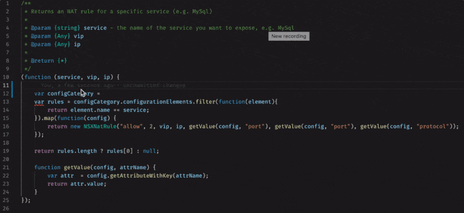
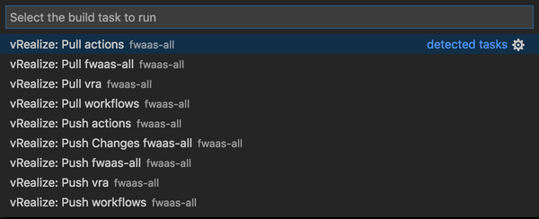

Before you continue with this section validate that all of the [prerequisites](./Setup-Developer-Workstation.md) are met.

## Features

### Multiple environments

Connect to different vRO environments by configuring maven profiles in `~/.m2/settings.xml`.

```xml
<profile>
    <id>my-env</id>
    <properties>
        <!-- vRO Connection -->
        <vro.host>10.27.120.27</vro.host>
        <vro.port>443</vro.port>
        <vro.username>administrator@vsphere.local</vro.username>
        <vro.password>myPlainTextPass</vro.password>
        <vro.auth>basic</vro.auth> <!-- or 'vra' for sso auth -->
        <vro.tenant>vsphere.local</vro.tenant>
        <vro.authHost>10.27.120.27</vro.authHost> <!-- required for 'vra' auth -->
        <vro.refresh.token>CrxGISrDKxqwfvitdnmlodXxneHARsFi</vro.refresh.token>

        <!-- vRA Connection -->
        <vra.host>10.27.120.27</vra.host>
        <vra.port>443</vra.port>
        <vra.username>configurationadmin@vsphere.local</vra.username>
        <vra.password>myPlainTextPass</vra.password>
        <vra.tenant>vsphere.local</vra.tenant>
    </properties>
</profile>
```

Once vRealize Developer Tools extension is activated in VS Code, on the bottom left corner of the status bar, an idicator is shown if there is no currently active profile.


Click on it to see list of all available profiles and select one to activate.


Active profile name and the IP address of the vRealize Orchestrator instance is shown in the status bar.


### Project on-boarding

The `vRealize: New Project` command from the VS Code comand palette (<kbd>Cmd+Shift+P</kbd> / <kbd>Ctrl+Shift+P</kbd>) can be used to on-board a new vRealize project.


### vRO-aware IntelliSense

Visual Studio Code's IntelliSense feature for JavaScript files is enhanced with with symbols and information from the vRO’s core scripting API, plug-in objects and actions.



### Run action

The `vRealize: Run Action` command from the VS Code comand palette (<kbd>Cmd+Shift+P</kbd> / <kbd>Ctrl+Shift+P</kbd>) allows running an action JavaScript file in live vRO instance while seeing the logs in the OUTPUT panel.


### Explore the inventory

A vRO explorer view is available in the activity bar that allows browsing the whole vRO inventory (actions, workflows, resources, configurations, packages and plugin objects).

-   Browse, search by name, fetch source (read-only) of all elements
-   Fetch schema (read-only) of workflows
-   3 different layouts for the actions hierarchy (controlled by `vrdev.views.explorer.actions.layout` setting)
    -   **tree** - Displays action packages as a tree
    -   **compact** - Displays action packages as a tree, but flattens any folders that have no children
    -   **flat** - Displays action packages as a list
-   Delete packages
-   Browse the inventory and see properties of each plugin object


#### Inventory Caching

There is a support for vRO inventory items caching in order not to overload vRO on heavily loaded environments. If the vrdev:vro:inventory:cache setting is enabled in the plugin settings, the vRO inventory items will be fetched once from the vRO server during visual studion code session. When there are changes in vRO inventory made during visual studio code session they will not be fetched. In order to maintain fresh load of data either disable the cache setting or reload the visual studio code.

### Push and Pull content

The VS Code build tasks palette (<kbd>Cmd+Shift+B</kbd> / <kbd>Ctrl+Shift+B</kbd>) contains commands for pushing content to a live vRO/vRA instance and for pulling workflows, configurations, resources and vRA content back to your local machine – in a form suitable for committing into source control.



The `vrdev.tasks.exclude` setting can be used to _exclude_ certain projects from the list of build tasks (`Cmd+Shift+B`) by using glob patterns

```javascript
"vrdev.tasks.exclude" : [
    "my.example.library*", // Exclude all libraries
    "!my.example.library*", // Exclude everything, except libraries
    "my.example!(library*)", // Exclude everything from 'my.example', except libraries
    "my.example.library:{nsx,vra,vc}", // Exclude nsx, vra and vc libraries
    "my.example.library:util" // Exclude util library (<groupId>:<artifactId>)
]
```

#### Display Hints in Java Script Projects

The VS Code plugin supports displaying action hints for modules and actions that are present in vRO along with the modules and actions that are part of the currently opened project. If you type:

```javascript
System.getModule("com.module.path.").
```

or

```javascript
Class.load("com.module.path.").
```

a list of hints with modules available on vRO and in locally opened projects would be presented as list, furthermore methods and parameters would be also present as hints, as shown in the example below:

./images/js-code-hinting.png

The hinting functionality also supports displaying hints for constructors, methods and attributes of all Scripting API (vRO plugin) objects available on the vRO server, as shown in the example below:

./images/js-plugin-hinting.png
